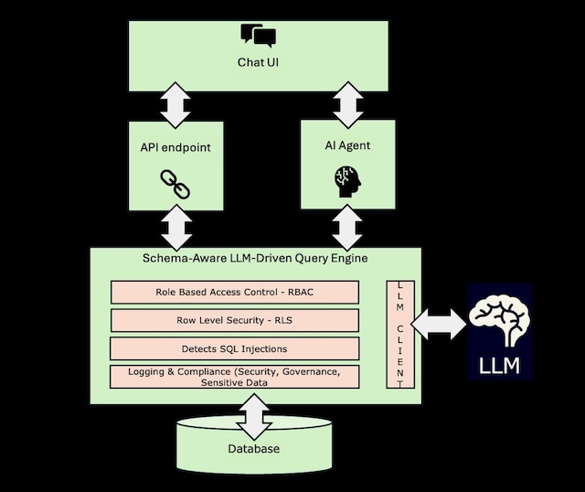

# 🧠 Schema-Aware AI SQL Agent

> ⚙️ Translate natural language into **secure, production-ready SQL** — built for real-world enterprise use.  
> ✅ Built with LangChain, FastAPI, Streamlit, and your preferred LLMs.  
> 🔐 Enforces schema validation, RBAC, RLS, and query sanitization.

---

## 🔍 What It Does

The **Schema-Aware AI SQL Agent** bridges the gap between LLMs and production databases.  
It turns plain English into SQL — safely — with full guardrails in place.

Built entirely in Python with open-source tools, it’s designed for environments where **security, compliance, and accuracy matter**.

🎬 **Watch the Walkthrough Video**  
👉 https://youtu.be/8PF6nWXB8iE

---

## ✨ Key Features

- 💬 Natural language to SQL with LLMs (OpenAI, OpenRouter, Ollama)
- 🔐 Role-based access control (RBAC) and row-level security (RLS)
- ✅ Schema-aware validation and SQL sanitization
- 🧠 Memory-aware chat agent with clarification flow
- ⚙️ REST API + Streamlit front-end
- 🧪 Sample PostgreSQL database (Northwind) included for testing

---

## 🧩 Architecture Snapshot

A high-level view from UI to LLM to SQL execution:



---

## 🚀 Quickstart

Prefer a visual walkthrough? Watch the [full setup & architecture demo here](https://youtu.be/8PF6nWXB8iE)

```bash
git clone https://github.com/raedmajid/schema-aware-ai-sql-agent
cd schema-aware-ai-sql-agent
python -m venv venv
source venv/bin/activate
pip install -r requirements.txt
cp .env.example .env  # then edit with your values
```

Start the backend:

```bash
uvicorn backend.api.api:app --host 127.0.0.1 --port 8000 --reload
```

Start the frontend UI:

```bash
python3 -m streamlit run frontend/chat_UI.py
```

Access the app at [http://localhost:8501](http://localhost:8501)

---

## 📖 Full Documentation

For detailed setup, advanced features, and system architecture, see:  
👉 [README_FULL.md](README_FULL.md)

<sub>Tip: Use <kbd>Ctrl</kbd>+<kbd>Shift</kbd>+<kbd>V</kbd> (or <kbd>Cmd</kbd>+<kbd>Shift</kbd>+<kbd>V</kbd> on Mac) in most editors to preview markdown files.</sub>

---

## 🛠️ License

MIT License — use it, modify it, build on it.
